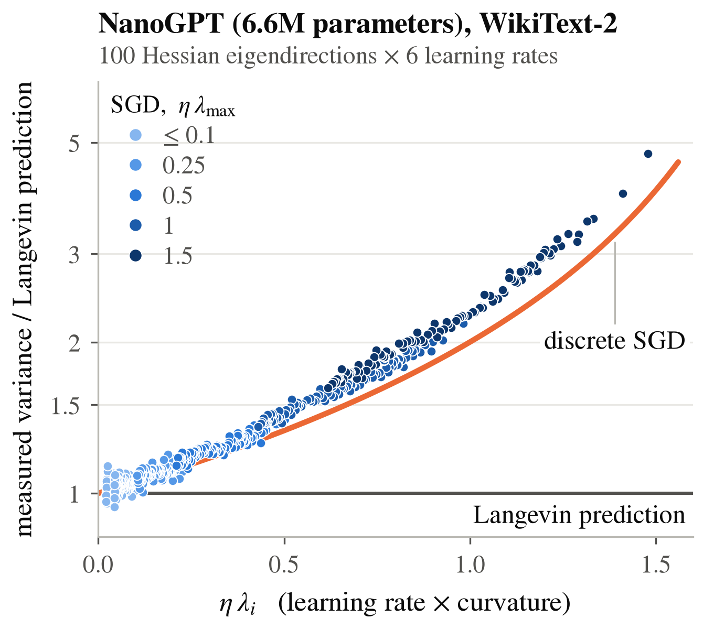

# NanoGPT (6.6M parameters) on WikiText-2: discrete SGD vs. the Langevin approximation

This directory contains the complete pipeline, the results and the figure of the
large-scale experiment of the paper.



## What is measured

SGD is started many times from a reference point `w*`. Along each of the 100 sharpest
eigendirections `v_i` of the mean Hessian we measure the variance of the iterates across
trajectories and compare it with two predictions for the stationary variance:

| | prediction |
|---|---|
| Langevin approximation | `eta d_i / (2 lambda_i - eta Gamma_ii)` |
| discrete SGD | `eta d_i / (2 lambda_i - eta (lambda_i^2 + Gamma_ii))` |

`lambda_i` is the curvature, `d_i` the variance of the minibatch gradient and `Gamma_ii` the
variance of the minibatch curvature along `v_i`. All three are measured at `w*`
independently of the trajectories, so no constant is fitted.

In the figure every point is one direction at one learning rate; the vertical axis is the
measured variance divided by the Langevin prediction, the horizontal axis is
`eta * lambda_i`. Langevin predicts 1 everywhere. Discrete SGD predicts the single curve
`(2 lambda_i - eta Gamma_ii) / (2 lambda_i - eta (lambda_i^2 + Gamma_ii))`, which is
`1 / (1 - eta lambda_i / 2)` up to the small ratio `Gamma_ii / lambda_i^2` (median 0.002).

## Protocol

| Stage | What it does |
|---|---|
| Model and data | NanoGPT: embedding 64, 2 heads, 4 layers, context 256, MLP ratio 4, untied output layer, 6,649,344 parameters. WikiText-2 (raw) with the GPT-2 BPE vocabulary, cut into 9,343 fixed training sequences of 257 tokens. Minibatches are sampled with replacement from this set, so the averages over minibatches are exact averages over it. |
| Training | Plain SGD, learning rate 0.05, minibatch 32, 200,000 steps, seed 0. |
| Reference point `w*` | Low-noise SGD at learning rate 0.02 (3,000 steps with minibatch 256, then 2,000 with minibatch 1,024), then 100 steps of full-gradient descent at learning rate 0.01. |
| Spectrum | Lanczos (500 iterations, full reorthogonalization) on a fixed subsample of 1,024 sequences gives 110 candidate vectors. Their exact Hessian-vector products over the whole training set are followed by Rayleigh-Ritz; one exact subspace-iteration step is repeated until 90% of the top-100 vectors have a relative residual below 1% (at most 3 rounds). |
| Noise statistics at `w*` | `d_i` from 8,000 minibatch gradients, `Gamma_ii` from 100 minibatch Hessian-vector products, both at minibatch 32. |
| Learning rates | `eta = c / lambda_max` with `c` in {0.05, 0.1, 0.25, 0.5, 1.0, 1.5}. |
| Trajectories | 240 independent SGD trajectories from `w*` per learning rate (minibatch 32; 500 steps for the two smallest learning rates, 300 for the others). The projection of `w_n - w*` on the 100 eigendirections and on 20 random directions is recorded at every step. |
| Variance | Across trajectories, averaged over the last 200 steps; 90% intervals from 1,000 bootstrap resamples of the trajectories. |
| Drift check | `lambda_i` and `d_i` are re-measured at the end points of 4 trajectories per learning rate. |

Matrix multiplications use TF32 (relative error about 1e-3); the projections on the
directions are computed in full single precision.

## Running

```bash
pip install -r requirements.txt
bash run_experiment.sh runs/nanogpt6m
```

The script picks the GPU with the most free memory; `GPUS="0 1"` splits the exact Hessian
rounds over two GPUs. Every stage is checkpointed, so the same command resumes an
interrupted run. On one NVIDIA A100 (80 GB) the run takes about 7 hours and needs about
26 GB of GPU memory.

Individual stages can be run directly, for example:

```bash
python pipeline.py --out runs/nanogpt6m --stages analyze
```

The figure is drawn by `make_figure.py`, either from the trajectories of a run or from the
saved points:

```bash
python make_figure.py runs/nanogpt6m runs/nanogpt6m
python make_figure.py --from-csv results/figure_points.csv results
```

## Results (`results/`)

Reference point: training loss 3.07, validation loss 7.69 (the validation loss is lowest,
5.65, at step 55,000, so the reference point lies in the overfitted regime; the analysis
concerns the training-loss landscape). The top-100 eigenvalues span 26.9 to 64.3, the
relative residuals of the eigenvectors have median 0.6% (90th percentile 1.6%), and the
full gradient at `w*` has norm 0.019.

Mean ratio of predicted to measured variance over the 100 directions:

| `eta * lambda_max` | `eta` | discrete SGD | Langevin | discrete SGD, noise at end points |
|---|---|---|---|---|
| 0.05 | 0.00078 | 0.998 | 0.982 | 1.001 |
| 0.10 | 0.0016 | 0.997 | 0.964 | 0.998 |
| 0.25 | 0.0039 | 0.985 | 0.906 | 1.008 |
| 0.50 | 0.0078 | 0.967 | 0.812 | 1.002 |
| 1.03 | 0.016 | 0.917 | 0.615 | 1.009 |
| 1.48 | 0.023 | 0.863 | 0.455 | 1.004 |

The Langevin approximation underestimates the variance by up to a factor of 2.2 on average
(up to 4.7 for the sharpest direction). The discrete prediction with the noise measured at
`w*` is accurate to 3% up to `eta * lambda_max = 0.5` and is 8-14% low beyond. The drift
check attributes this to the growth of the gradient noise away from `w*` (the curvature is
unchanged, the noise along the sharp directions is larger by a factor of up to 1.16, see
`report.txt`); with the noise measured at the trajectory end points the discrete
prediction agrees with the data within 1% at all six learning rates. No trajectory
diverged.

Finishing the reference point with full-gradient descent alone, from the same SGD end
point, leaves a five times larger gradient (0.105 instead of 0.019).

| File | Content |
|---|---|
| `fig_nanogpt_finite_step.pdf`, `.png` | the figure |
| `figure_points.csv` | the 600 plotted points |
| `report.txt`, `summary.json` | all comparisons: predictions vs. measurements, bootstrap intervals, ratio test, drift check |
| `spectrum.json` | eigenvalues and eigenvector residuals after each exact round |
| `stats.json` | `d_i`, `Gamma_ii` and their cross-checks |
| `traj_spec.json` | learning rates and trajectory lengths |
| `finish_log.json`, `refine.json` | loss, gradient norm and sharpness after each finishing phase |
| `train.json` | training and validation loss during training |
| `drift.json` | noise and curvature at trajectory end points |

The trajectory projections themselves (about 250 MB) are not stored in the repository;
they are regenerated by the pipeline with the same seeds.
